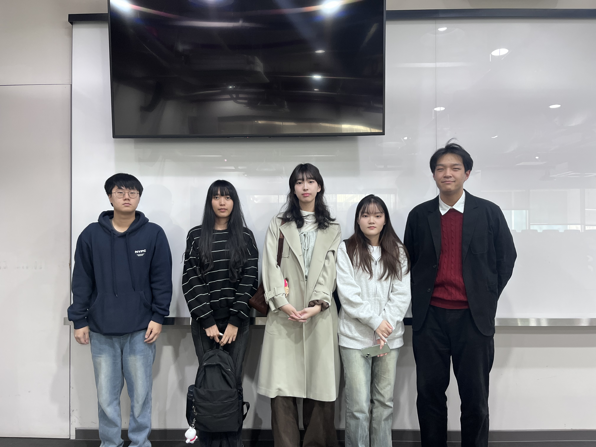

# Welcome to 11팀

## 1️⃣ 팀원 소개

| **이름** | **전공** | **관심사** |
| --- | --- | --- |
| **위명준** | 소프트웨어전공 | 해외인턴, 인공지능, 프론트엔드 |
| **최우혁** | 소프트웨어전공 | 보안, 프론트엔드, 백엔드, 인공지능 |
| **최주원** | 소프트웨어전공 | 프론트엔드, 백엔드, 앱 개발 |
| **엔드라 찬메이** | 소프트웨어전공 | UX/UI, 모바일 앱, 창업 |
| **오태유** | 소프트웨어전공 | 분산 시스템, 데이터베이스, 오픈소스 |

### 팀 슬로건

 Byte Your Future
 
 '소프트웨어 기술로 (Byte) 우리의 미래를 개척해나가자'는 의미를 담은 슬로건 입니다.

### 팀 소개

우리는 소프트웨어로 세상을 바꾸는 사람들입니다. 아이디어를 코드로, 상상을 현실로 만드는 것이 우리의 일상입니다. 끊임없이 배우고, 도전하며, 함께 성장하는 팀. 작은 프로젝트 하나에도 열정을 담아, 더 나은 미래를 만들어갑니다.

***

## 2️⃣ 공통된 관심사 : 

***

## 3️⃣ 한학기 동안의 활동 내역 
# 3주차 활동 : 과거 사람들이 생각한 미래
  - 1995년에 그려진 내용을 보면서 현재 가능한 기술이 무엇인지 살펴보고 논의하기

    - 현재 실현된 기술은? 
      : 태양열 발전 주택, 전기자율주행차, 소형TV전화기, 전파신문, 움직이는 도로, 로봇청소기, 원격학습, 원격진료, 스마트 부엌, 인터넷 강의
    - 느낀점
      : 과거에 상상했던 대부분의 기술들이 현재 구현되었고, 이처럼 기술을 통해 발전하려면 제한을 두지않고 상상해보는 것이 중요한 것 같다.

  - MICROSFT FUTURE VISION, 현실이 된 90년대의 상상, 유리와 함께 하는 하루 3개의 영상을 보고 실현된 기술이 뭔지 논의해보기

    - 현재 실현된 기술은?
      : 휴대폰 결제기능, 아담(사이버 연예인), 자율주행자동차, 스마트폰 
    - 느낀점
      : 얇은 디지털 신문지를 보고 불가능하다고 생각했는데 기술적으로 가능한 것처럼, 과거에 사람들이 불가능하다고 생각했던 것들도 현재 우리의 기술로 개발할 수 있다는 것이 인상적이었다.
        미래에는 유리와 관련된 산업이나 기술이 더욱 발전할 것 같다고 생각했다.

# 4주차 활동 : 그들이 만들어 가는 세상
# 📡 MIT Sixth Sense 프로젝트 정리

## 🔍 <MIT Sixth Sense 연구팀이 만들고자 했던 것은?>

- **Why**:  
  물리적 세계와 디지털 세계의 격차 해소.  
  일상의 사물과 삶에 디지털 정보를 투사하여 정보를 직관적으로 사용하기 위해서.

- **What**:  
  웨어러블 제스처 인터페이스  
  → 사용자가 자연스러운 손 제스처를 통해 디지털 정보와 상호작용

- **How**:  
  포켓 프로젝터, 거울, 카메라  
  - 프로젝터: 시각 정보 투사  
  - 카메라: 손 제스처 추적 및 사용자의 의도 이해

---

## 🔄 <As-Is vs To-Be>

| 기존 장치 (As-Is) | 미래 대체 방식 (To-Be) |
|-------------------|-------------------------|
| 키보드            | 손 제스처로 문자 및 명령 입력 |
| 마우스            | 손 제스처로 커서 이동 및 클릭 |
| 모니터            | 주변의 모든 표면/사물에 정보 출력 |

---

## 🧠 <현재 구현된 기술 장비와 방식>

- **증강 현실 헤드셋 및 글래스**  
  Apple Vision Pro, Microsoft HoloLens 등 AR 헤드셋과 글래스를 통해 정교하게 구현됨

- **제스처 인식 및 미접촉 인터페이스**  
  고성능 카메라 센서와 AI 기반 컴퓨터 비전 기술로 발전

- **모바일 AR 및 사물 인식**  
  스마트폰과 태블릿의 카메라를 기반으로 하는 모바일 증강현실 기술  
  예: Google Lens

- **웨어러블 컴퓨팅의 소형화**  
  초기 Sixth Sense 프로토타입은 크고 연결된 장치가 필요했지만  
  현재는 스마트워치, 스마트글래스 등 웨어러블 기기에 컴퓨팅, 센서, 통신 기능이 통합됨

---

## ✨ 느낀점

> Sixth Sense 프로젝트 영상은 단순한 기술 시연을 넘어  
> 인간의 상상력이 어떻게 현실을 재구성하고  
> 세상을 더 나은 방향으로 이끌 수 있는지를 보여준다.  
> 꿈을 꾸는 사람들은 불가능해 보이는 것을 가능하게 만들 뿐 아니라  
> 우리가 살고 싶은 세상을 만들어나간다고 느꼈다.
# 5주차 활동: 2040년 또는 2050년 우리들의 생활 모습 예측하기

## 📌 점진적 발전과 현실적 제약 중심으로

- **물리적 변화는 제한적일 것**
  - 자율주행 등 물리적 기술은 현실의 다양한 변수로 인해 사고 가능성이 존재하며, 사회 제도적 규제로 인해 개발 속도가 더딜 것으로 예상됨.

- **간접적 해결을 위한 가상화 기술의 발전**
  - 물리적 문제를 직접 해결하기보다는, 가상화 기술을 통해 간접적으로 대응하는 방향으로 발전할 가능성이 높음.
  - 예: 화상회의 기술의 품질이 점진적으로 향상됨.

- **한국 개발 생태계의 갈라파고스화**
  - 한국은 여전히 자바 개발이 주류로 남아 있어 갈라파고스화되는 경향이 있으며,
  - 그 외 소프트웨어 산업은 빠르게 전환 중.
  - 이로 인해 개발자의 평균 퇴직 연령이 극단적으로 낮아질 가능성이 있음.

---

## 🚀 비약적 발전과 이상적 미래 전망 중심으로

- **장기 바이오 프린팅**
  - 손상된 장기나 조직을 대체하기 위해 환자의 세포를 활용한 3D 바이오 프린팅 기술로
  - 맞춤형 인공 장기를 제작하는 기술이 보편화될 전망.

- **노화 치료 기술**
  - 노화 세포 제거 기술 및 수명 연장 약물의 개발로 인해 평균 수명이 증가할 것으로 예상됨.

- **배양육 및 대체 식품의 보편화**
  - 실제 가축을 기르는 대신, 배양육과 식물성 대체 식품이 식탁의 주류를 이루게 될 것.

- **쓰레기의 자원화**
  - 가정 및 도시의 폐기물이 로봇의 에너지원 또는 다른 시스템의 자원으로 변환되는 기술이 발전할 것.

- **개인화된 AI 튜터**
  - 학생 개개인의 학습 성향에 맞춘 AI 튜터를 통해
  - 최적화된 콘텐츠와 속도로 학습할 수 있는 환경이 조성될 전망.

- **스마트 도시와 자율주행 모빌리티**
  - 도시 전체가 AI로 운영되며, 자율주행 차량과 드론 택시가 거리를 누비는 모습.

- **개인 맞춤형 라이프스타일과 헬스케어**
  - AI 비서가 개인의 건강, 식단, 일정 등을 관리하고 웨어러블 기기가 일상생활에 깊숙이 활용됨.

- **지속 가능한 환경과 에너지**
  - 태양광, 풍력 등 신재생 에너지로 도시가 운영되며, 인공 숲, 자동 폐기물 분류, 해양 플라스틱 수거 로봇 등 다양한 환경 기술이 적용됨.

- **미래의 교육**
  - AR 교과서, 메타버스 캠퍼스, 로봇 선생님 등 실감형 콘텐츠와 AI 튜터가 교실을 대체하거나 보완함.

- **우주 및 해양 라이프**
  - 우주 여행과 해양 거주지가 일반화되고, 해조류 농장이나 탄소 포집 시설 등으로 환경을 관리하는 모습.

# 10주차 활동: Future Vision Day

## ✨ 전시회를 둘러보고 인상 깊었던 팀

---

## 🚀 2조 우리가 상상한 미래

- **반중력 장치·디지털 바이오 시대·스마트 인프라**
  - 도시 전체가 기술로 유기적으로 연결된 미래를 상상한 팀.
  - 공중에 떠 있는 도시 구조, 자율주행 교통 시스템, 개인 맞춤형 생활 공간 등 시각자료가 특히 설득력 있었음.

- **생활 방식과 주거 환경 변화까지 접근**
  - 단순히 미래 건축이나 기술을 나열한 것이 아니라,
  - “미래의 개인이 어떻게 살아갈 것인가?”까지 통찰한 구성이 돋보였음.

- **팀원 의견 개별 정리**
  - 팀원 각자의 관점을 별도로 구성해 신선했던 구성 방식.

---

## 🌌 4조 2040·2050년대의 미래

- **인간 존재 자체를 재정의하는 기술**
  - 자기 복제 기술  
  - 신경 연결 구조 기록  
  - 뇌 업로드  
  - 수면 단축  
  - 인간 수명 연장 기술  

- **뇌 업로드의 관점**
  - 죽음을 “신체의 끝이 아닌 정보의 이식”으로 바라보는 점은  
  - 실제로도 논의되는 주제라 높은 몰입도를 제공함.

- **윤리 문제까지 언급**
  - 기술적 설명뿐 아니라 윤리적 고민까지 다뤄 깊이 있는 전시였음.

---

## 💡 느낀 점

- 기술 발전을 바라볼 때  
  **편리함·효율성뿐 아니라 인간다움·사회적 의미·윤리적 기준**까지 고려해야 함을 느꼈음.

- 미래 기술이 빠르게 발전하더라도  
  **그 중심에는 항상 인간 가치가 있어야 한다는 점을 다시 깨달았음.**

# 11주차 활동: 대학원소개/대학원 선배와 대화

## ✨ 대학원 선배와의 만남 후기

- **연구에 대한 열정**
  - 일주일에 6일을 학교에서 연구한다는 이야기를 듣고 놀랐지만,
  - 특정 분야에 대한 열정이 있어 스스로 선택한 길이라는 말에 감명받았음.
  - 나도 언젠가 내가 정말 좋아하는 연구 분야를 찾아
    그 분야에 깊이 몰입하는 대학원생이 되고 싶다는 생각을 하게 됨.

- **공부 방향에 대한 조언**
  - 현재 배우는 많은 전공 내용과 프로그래밍 언어들이
    대학원에서의 연구에서는 ‘기초’가 된다고 조언해 주셨음.
  - 따라서 모든 내용을 완벽히 외우려 하기보다,
    **학부 공부(기초)와 내가 연구하고 싶은 분야의 공부(심화)를 나누어 진행**하는 것이 좋다고 말씀해 주심.
  - 이 말을 듣고 앞으로의 공부법을 조금 수정해야겠다고 느꼈음.

- **인공지능 진학 조언**
  - 인공지능 분야의 많은 직무는 **석사 이상 학위**를 요구한다고 하셨음.
  - 인공지능 관련 직무를 고려한다면 사실상 대학원 진학이 필수적이라는 현실적인 조언을 들음.

- **선배님의 연구 분야**
  - GPU 기반 **계산량 최적화 / 하드웨어 가속** 관련 연구를 하고 계심.
  - 연구실 교수님과 연구 관심사가 잘 맞아 함께 연구 중이라고 하셨음.

- **대학원 입시 조언**
  - 학점이 아주 높은 편은 아니었지만,
    **연구 열정과 인공지능 관련 경험**을 적극적으로 어필해 대학원에 진학하셨다고 함.
  - 즉, 학점도 중요하지만 그보다 더 중요한 것은
    **호기심·열정·관심 분야 관련 경험**이라는 점을 강조하셨음.

- **배운 점**
  - 연구실 경험, AI 프로젝트 경험 등 학부 때부터 꾸준히 관련 활동을 쌓는 것이 중요함을 깨달음.
  - 무엇보다도 **스스로 좋아하는 분야를 찾고, 그 분야에 대한 연구 열정을 키워가는 과정**이 중요하다는 것을 배움.

# 12주차 활동: 교과과정 및 비교과프로그램 소개/교수님과 대화

# 📘 나의 지도교수님 함께 만나기 with 안인규 교수님
---
.jpg)

## 1. 느낀 점
소프트웨어학부 지도교수님을 직접 만나 학부 생활과 진로에 대한 실질적인 조언을 들으며  
앞으로의 학업과 진로 선택에 큰 도움이 된 의미 있는 활동이었다.  

팀원들과 함께 사전 질문을 준비해 면담을 요청했고, 교수님께서는  
전공 공부 방법, 대학원 진학, 개발자로서의 방향성 등 폭넓은 내용을 자세히 설명해 주셨다.  
이번 면담을 통해 앞으로 어떤 역량을 갖추어야 하는지 더 구체적으로 알게 되었다.

---

## 2. 주요 질의응답 정리

### (1) 전공 과목 중 가장 중요한 과목은 무엇인가요?
- 중요 과목은 **본인이 어떤 전문가가 되고 싶은지에 따라 달라진다.**
- 목표 분야를 먼저 설정하고, 필요한 과목을 스스로 선택하는 것이 가장 올바른 접근.

---

### (2) 대학원 진학을 위해 언제부터 어떻게 준비해야 하나요?
- 교수님의 연구실은 **3학년부터 대학원생을 선발**한다.
- 가장 중요한 기준은  
  **“연구를 얼마나 성실하고 꾸준히 할 수 있는가”**
- 학점은 성실성의 지표가 되기 때문에 중요하며,  
  기본 이상의 코딩 실력과 명확한 연구 동기가 필요하다.

---

### (3) 프론트엔드 개발자가 되기 위해 중요한 것은?
- **스스로 진행한 프로젝트로 구성된 포트폴리오**가 가장 중요하다.
- 단순 과제 수준이 아닌 **주도적 프로젝트 경험**이 필요함.

---

### (4) 코딩 실력을 기르려면 어떻게 공부해야 하나요?
- **알고리즘 공부가 가장 효과적인 방법**이라고 조언하심.

---

### (5) 어떤 프로그래밍 언어가 중요한가요?
- 모든 언어를 잘할수록 좋으며, 언어 간 큰 차이는 없음.
- C++을 특히 중요하게 생각하심.  
  **C++을 잘하면 다른 언어도 잘할 수 있다**고 강조.
- 특정 언어 집착보다는  
  **필요한 언어를 스스로 학습할 수 있는 능력**이 더 중요하다.

---

### (6) 프로그램의 전체 틀 구성에 어려움이 있을 때 어떻게 극복할까요?
- **오픈소스 프로젝트를 많이 활용**하라고 하심.
- 남들이 작성한 **크고 다양한 프로젝트를 많이 다뤄볼수록**  
  전체 구조를 파악하고 설계하는 능력이 향상된다.

---

### (7) 교수님의 연구 분야는 무엇인가요?
- 로봇틱스 중 **로봇의 청각(소리 인식)** 관련 연구를 진행 중.
- 로봇이 고차원적 판단을 내릴 수 있도록 하는 알고리즘 연구 포함.

---

### (8) 개발자가 갈 분야 중 전망이 밝은 분야는?
- 미래 전망을 정확히 예측하기는 어렵다고 하셨음.
- 최근 네이버·카카오 등 대형 IT 기업은 채용을 많이 하지 않지만  
  **방산 분야는 채용 규모가 커 전망이 밝다**고 조언.
- 결국 **어디에 취업하든 내가 하고 싶은 분야를 꾸준히 열심히 하는 것이 가장 중요**하다고 강조.

## 4️⃣ 인상 깊은 활동

- 위명준: 과거 사람들이 상상했던 미래를 현재 기술과 비교하며 예측해보는 활동/ 과거의 상상이 지금 실제 기술로 구현된 사례를 보면서, 우리의 현재 상상도 미래에는 실현될 수 있다는 생각이 들었다. 또한 2050년대 미래를 상상하며 기술 발전의 방향과 사회적 영향, 그리고 삶의 변화를 함께 고려할 수 있었던점이 매우 의미있었다.
   
- Eaim Dra: 나의 지도교수님 함께 만나기/ 지도교수님을 만나 뵙고 프론트엔드에 관심이 있다고 말씀드렸을 때, 스스로 프로젝트를 햐보는 것이 정말 중요하다는 조언을 포함해 여러가지 핵심적인 내용을 알게되어 큰 도움이 되었다고 느꼈다.

- 최주원: 대학원생 선배 만나기/ 대학원생 선배를 만나서 대학원생을 어떻게 연구를 진행하고 공부하는지에 대한 정보를 얻고, 선배님의 연구에 대한 열정과 학부과정의 학습방법에 대한 조언을 통해 대학원 진학을 고려해보게 되었다.

## 5️⃣ 특별히 알아보고 싶은 것
- 위명준: 국민대 소프트웨어학부에서 제공하는 현장 실습 프로그램의 운영방식과 참여기회, 그리고 실제 산업 현장에서 얻을 수 있는 경험
  
- Eaim Dra: 게임 UI 디자인을 웹사이트 화명 디자인에 적용해보기, 웹사이트에서 게임처럼 인터랙션이 있는 UI 만들기 연구, 초보자를 위한 웹 기반 미니 게임 UI 제작과정
  
- 최주원: 취업에 도움이 되는 포트폴리오/프로젝트 준비 방법, 코딩테스트, 졸업생 선배님의 취업 준비 경험
  
## 6️⃣ 활동을 마친 소감

🔗20231884 위명준 
> 이번 활동을 통해 미래에 대한 폭넓은 상상을 기술을 기반으로하여 실현할 수 있음에 큰 의미를 느꼈으며, 실용적이며 사람 중심의 기술을 만들고 싶다는 다짐을 하게되었다.  또한 학과에서 제공하는 다양한 활동과 프로젝트에 참여하며 성장하고자 하는 의지도 생겼다.

🔗학번 Eaim Dra 
> 좋은 팀원들과 함께 관심있는 분야에 대해 서로 의견을 나누고, 교수님과 소프트웨어, AI분야의 전문가들의 경험을 들으며 그 경험을 바탕으로 더 성장해 나가겠다는 다짐을 하게되었다.

🔗20252924 최주원 
> 유레카 프로젝트 수업을 통해 2050년 미래를 상상해보는 활동을 통해 미래에 어떤 기술이 필요하며, 어떠한 분야가 전망이 좋은지까지 생각해보는 계기가 되었으며, 대학원생 선배 만나기 활동과 나의 지도교수님 함께 만나기 활동을 통해 나의 진로와 학업 계획을 점검해 보는 계기가 된 것 같다.

